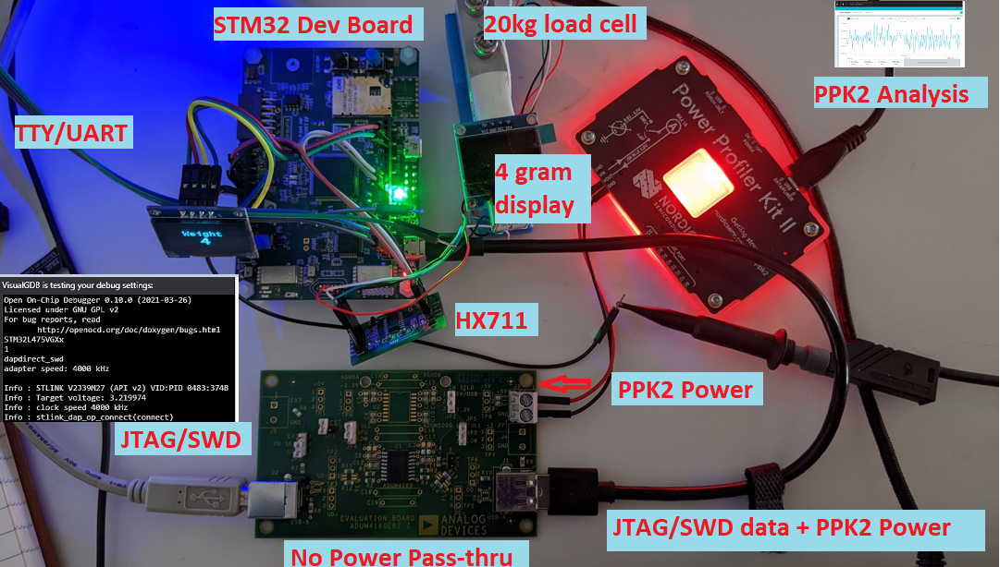

# Power Analysis

The worksheet describing Wordy’s power use is demonstrated in the lecture. Make one for your
system (either design or engineering version).

Estimates are ok in place of real numbers. If you have many components, limit it to the top 5-8
most likely to consume power. Even if you have a USB or wall powered system, identify the
largest consumers of power and how you might reduce power consumption.

Turn in a link to your power worksheet to Discord #assignment-submission by 9am on Feb 13th.

## Overview:

> "_only ST-LINK circuit has the power before USB enumeration, because the host PC only provides 100 mA to the board at that time. During the USB enumeration_"
-- [UM2153](https://www.st.com/resource/en/user_manual/um2153-discovery-kit-for-iot-node-multichannel-communication-with-stm32l4-stmicroelectronics.pdf) section 7.4 Power supply.

Here's a diagram of the Power Analysis Setup:

See my [blog](https://gojimmypi.github.io/ppk2-power-analysis/) for additional Power Analysis setup information.

## What are the different states the device can be in?

That various sleep modes (and all the other HAL details) are discussed in the 2,600+ page [UM1884 PWR Firmware driver API description](https://www.st.com/resource/en/user_manual/dm00173145-description-of-stm32l4l4-hal-and-lowlayer-drivers-stmicroelectronics.pdf) guide. There are 8 main Power Modes and several sub-modes  summarized in [this STM32L4 Power Presentation](https://www.st.com/content/ccc/resource/training/technical/product_training/ce/57/a3/86/7a/3d/4d/87/STM32L4_System_Power.pdf/files/STM32L4_System_Power.pdf/jcr:content/translations/en.STM32L4_System_Power.pdf):

## How much will your device be in each state?

My goal is to have two main power modes: `On` and `Deep Sleep`. The `On` mode requires a whopping 120mA. I've not yet determined how to successfully put my device into sleep mode.

## How much current is used in each state?

I used a [Nordic Power Profile Kit](https://www.nordicsemi.com/Products/Development-hardware/Power-Profiler-Kit-2) to measure board power.

See [UM1884 Description of STM32L4/L4+ HAL and low-layer drivers](https://www.st.com/resource/en/user_manual/dm00173145-description-of-stm32l4l4-hal-and-lowlayer-drivers-stmicroelectronics.pdf) for information on `HAL_PWR_EnterSLEEPMode()`.

Curiously, even when paused in the debugger, there's a fluctuation in power:

These peripherals, many of which are unused for this project, also consume power (most are assumed in "off" low power state unless initialized, but they may need to be manualyl turned off).

* SPBTLE-RF Bluetooth

* SPSGRF-868 or SPSGRF-915 Sub-GHz (868 or 915 MHz) low-power-programmable RF module

* 64-Mbit Quad-SPI NOR Flash memory

* ISM43362-M3G-L44 Wi-Fi module Inventek system  (802.11 b/g/n compliant)

* MP34DT01 ST-MEMS microphones

* HTS221 relative humidity and temperature low-power consumption: 2 μA  (page 25).

* LPS22HB 260-1260 hPa absolute digital output barometer

* LIS3MDL High-performance 3-axis magnetometer

* VL53L0X Time-of-Flight and gesture detection sensor

* LED indicator lights (9x of them)

## How long will the device last given a 40mAh battery?

At 120mA draw, not very long. The dev board likely won't even power on!

## Additional Information

### Caution

Do not connect the PC to the ST-LINK (CN7) when R30 is soldered. The PC may be damaged
or the board may not be powered correctly. From page 17 of [UM2153](https://www.st.com/resource/en/user_manual/um2153-discovery-kit-for-iot-node-multichannel-communication-with-stm32l4-stmicroelectronics.pdf)

### Power Tree

From page 18 of [UM2153](https://www.st.com/resource/en/user_manual/um2153-discovery-kit-for-iot-node-multichannel-communication-with-stm32l4-stmicroelectronics.pdf)

<< [Exercise 9](./Exercise_9.md) -- [Assignments](./README.md) --  END