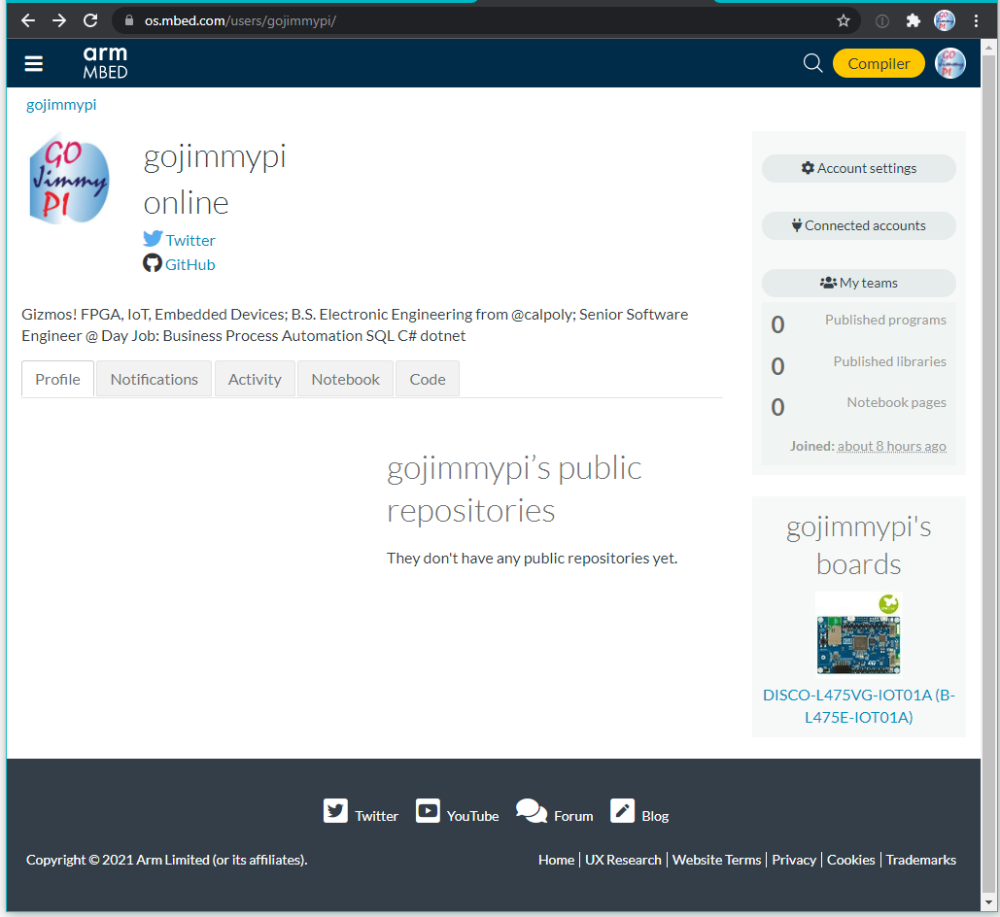
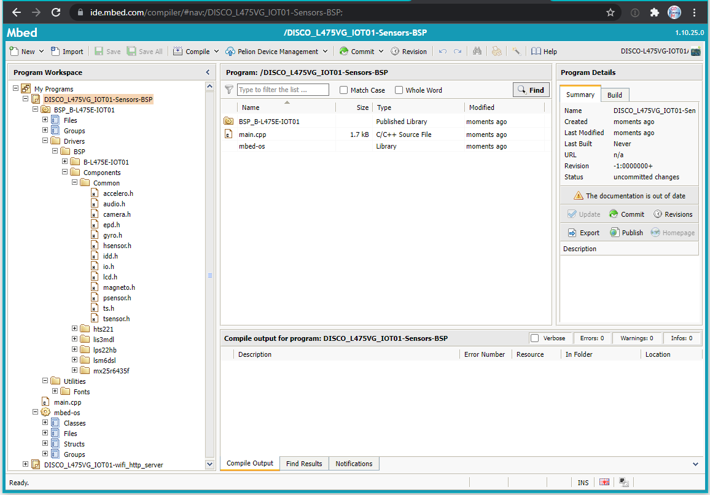
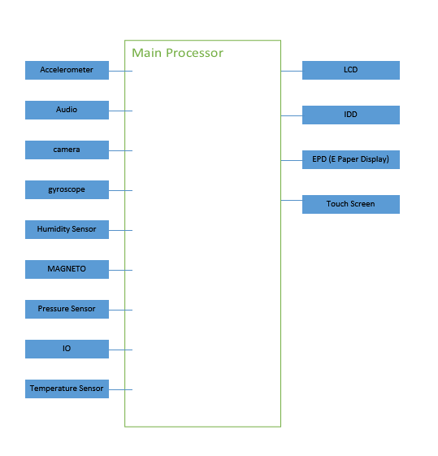

# Read Mbed Code, Make Diagram

Exercise 2.2 for [Making Embedded Systems](https://lms.classpert.com/classpertx/courses/making-embedded-systems/cohort) class. 

Read mbed code, make diagram
- Create a sign in and log into the mbed compiler
- Go to mbed platforms https://os.mbed.com/platforms/
- Select any platform (hint: search for a processor similar to the one you are considering
for your final project)

- Read through the platform page
- Add to Mbed Compiler (button on right)
- Load a simple sounding template

- Create a block diagram for this program, briefly explain why you chose the platform
and template you did, be prepared to talk about this board in Live Class

I chose the STM32L4 Discovery kit IoT node: [DISCO-L475VG-IOT01A (B-L475E-IOT01A)](https://os.mbed.com/platforms/ST-Discovery-L475E-IOT01A/)
for this class as it has a wide selection of built-in perihperals, and more importantly: plenty of _sample code_.

<< [Exercise 2.1](./Exercise_2_1.md) -- [Assignments](./README.md) -- [Exercise 3a](./Exercise_3a.md)
