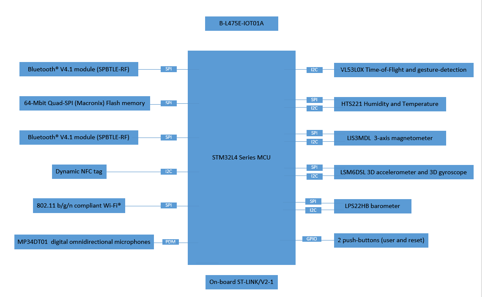

#Investigate project board

Exercise 3a for [Making Embedded Systems](https://lms.classpert.com/classpertx/courses/making-embedded-systems/cohort) class. 

Look at the documents for the board you are considering for your final project (or any 
[ST Discovery Board](https://www.st.com/en/evaluation-tools/stm32-discovery-kits.html#products)), draw the hardware block diagram for the board. For peripherals, note the
communication paths (SPI, I2C, etc).

The board I am using is the [B-L475E-IOT01A1](https://www.mouser.com/ProductDetail/STMicroelectronics/B-L475E-IOT01A1?qs=sGAEpiMZZMug%252BNZZT2EIM4vIP4F171Wi%2F6Nv7F56rKE%3D), 

## Look at the [datasheet](https://www.mouser.com/datasheet/2/389/b-l475e-iot01a-1848022.pdf) for the processor and other documents. Answer these questions:

### What kind of processor is it?

The processor is the [STM32L475VG](https://www.st.com/resource/en/datasheet/stm32l475vg.pdf), part of the [STM32 Ultra Low Power](https://www.st.com/en/microcontrollers-microprocessors/stm32-ultra-low-power-mcus.html)
Arm® Cortex®-M4 32-bit MCU+FPU, 100DMIPS, USB OTG FS, analog, audio

### How much Flash and RAM does it have? Any other memory types?
up to 1MB Flash, 128 KB SRAM, USB OTG FS.

### Does it have any special peripherals? (List 3-5 that you noted as being interesting.)
20x communication interfaces! Including:

- USB OTG 2.0 full-speed
- 3x I2C
- 3x SPIs (and 1x Quad SPI)

### Does it have a floating point unit?
yes, this chip has 32-bit MCU + FPU 

### If it has an ADC, what are the features?
Rich analog peripherals (independent supply)
– 3x 12-bit ADC 5 Msps, up to 16-bit with hardware oversampling, 200 µA/Msps
– 2x 12-bit DAC output channels, low-power sample and hold
– 2x operational amplifiers with built

Look at one [application note](https://www.st.com/en/microcontrollers-microprocessors/stm32l475vg.html#documentation) for this processor.

[AN5012 Analog-to-digital audio conversion example using STM32L4 Series microcontroller peripherals](https://www.st.com/resource/en/application_note/an5012-analogtodigital-audio-conversion-example-using-stm32l4-series-microcontroller-peripherals-stmicroelectronics.pdf)

<< [Exercise 2.2](./Exercise_2_2.md) -- [Assignments](./README.md) --  [Exercise 3b](./Exercise_3b.md)   