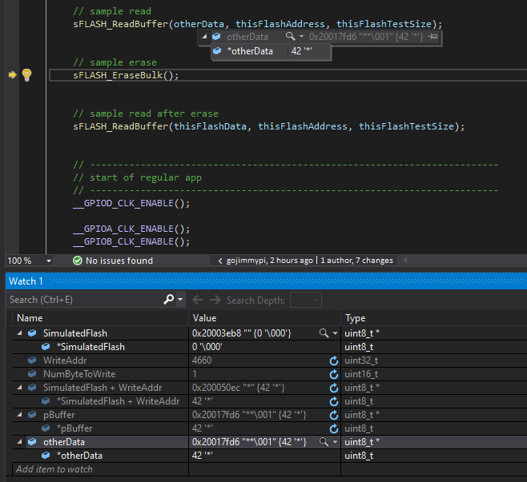

# SPI Flash Test Code

Unfortunately, the SPI Flash we need to test the Key-Value storage system is on backorder. The
KVStore only uses the read, write, and erase functions from the SPI Flash subsystem. Create a
small simulator so you can test the KVStore. Write a test for your simulator that uses the read,
write and erase functions.

Here is the SPI Flash information.
https://www.digikey.com/en/products/detail/winbond-electronics/W25Q80DVSNIG-TR/5154948

We are going to use ST�s Standard Peripheral Flash Driver so here is the header file for the
code you will need to simulate:

https://drive.google.com/file/d/12dw-pZiKiK1vi4gv49W1x6np5uzCH_cV/view?usp=sharing

Your assignment is to create a small module that compiles and runs on your computer that
implements your flash simulator. You will also need a main file to test out your simulator.
Important notes: You don�t need a full Flash simulator, only what is necessary to test the
KVStore code. You aren�t writing the KVStore code. You do not need to use CPPUTest or other
unit test framework. If you are writing more than 50 lines of code, you are going in the wrong
direction.

### Turn in two source files (simulator and main test)
and send a link to the #assignment-submission channel on Discord. Make sure the files are publicly viewable.

See [_main.c](https://github.com/gojimmypi/IoT_BBQ/blob/e4ca09b48812742fda096bde2ac1601ff15743d8/IoT_BBQ_STM32/_main.c#L65) sample usage
and [spi_flash.c](https://github.com/gojimmypi/IoT_BBQ/blob/e4ca09b48812742fda096bde2ac1601ff15743d8/IoT_BBQ_STM32/spi_flash.c#L11) simulation.

#### Write

`sFLASH_WriteBuffer` simulation:

`sFLASH_WriteBuffer` simulation _before_ write:

`sFLASH_WriteBuffer` simulation _after_ write:

#### Read

`sFLASH_ReadBuffer` simulation, _before_:

`sFLASH_ReadBuffer` simulation:

`sFLASH_ReadBuffer` simulation, _before_ edit:

`sFLASH_ReadBuffer` simulation, _before_ edit, detail:

`sFLASH_ReadBuffer` simulation, _after_ edit:

#### Erase

`sFLASH_EraseBulk`

`sFLASH_EraseBulk` _before_ read:

<< [Exercise 3a](./Exercise_3a.md) -- [Assignments](./README.md) -- [Exercise 4](./Exercise_4.md)