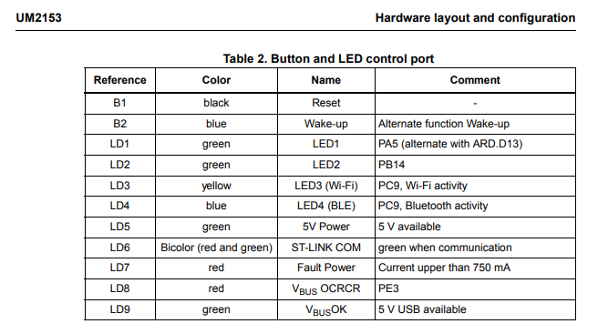
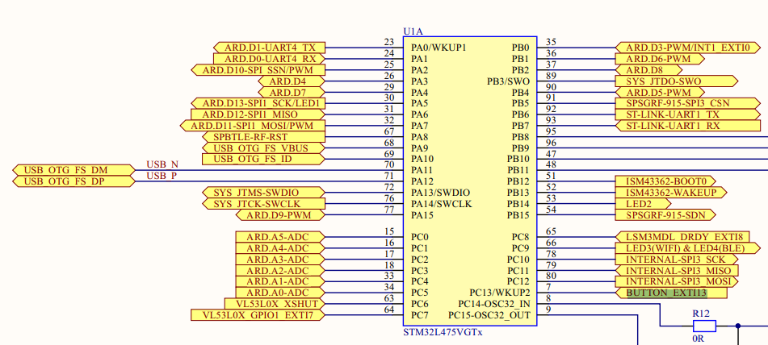
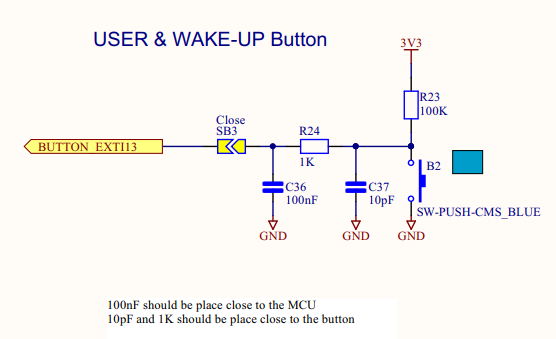
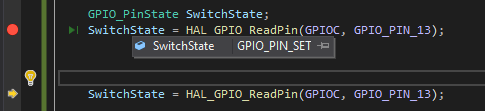
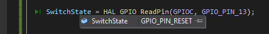

# Exercise 4: Make Blinky

On your final project board, make blinky for yourself. Then add a button to turn the LED on and off. 
Bonus points for making the button cause an interrupt. Triple bonus points for debouncing the button signal.

## What are the hardware registers that cause the LED to turn on and off? (From the processor manual, don’t worry about initialization.) 

My [Initial VisualGDB project](https://github.com/gojimmypi/IoT_BBQ/tree/f9dab949fbbb88e6c5072c864743b30965233673/IoT_BBQ_STM32) 
coincidentally happened to be a [Blinky for RTOS](https://github.com/gojimmypi/IoT_BBQ/blob/f9dab949fbbb88e6c5072c864743b30965233673/IoT_BBQ_STM32/IoT_BBQ_STM32.c#L100).

Unfortunately, the [default GPIO assignments for that tempate project](https://github.com/gojimmypi/IoT_BBQ/blob/f9dab949fbbb88e6c5072c864743b30965233673/IoT_BBQ_STM32/IoT_BBQ_STM32.c#L62)
were incorrect. Instead of [GPIO_PIN_12 and GPIO_PIN_13](https://github.com/gojimmypi/IoT_BBQ/commit/67924b3a7dde185c6e0f1158f6e9990a50225455#diff-faa7d63cec73dbe50689e1c79169000372289c072488b7f9f469e22e6f4d3a20)
I found that my board has LEDs `LED1` on Port A [GPIO_PIN_5](https://github.com/gojimmypi/IoT_BBQ/blob/67924b3a7dde185c6e0f1158f6e9990a50225455/IoT_BBQ_STM32/IoT_BBQ_STM32.c#L69)
and `LED2` on Port B [GPIO_PIN_14](https://github.com/gojimmypi/IoT_BBQ/blob/67924b3a7dde185c6e0f1158f6e9990a50225455/IoT_BBQ_STM32/IoT_BBQ_STM32.c#L79) as shown in Table 2 in Chapter 7 of the 
[User Manual](https://www.st.com/resource/en/user_manual/um2153-discovery-kit-for-iot-node-multichannel-communication-with-stm32l4-stmicroelectronics.pdf):




## What are the button registers that you read? 

There are 2 buttons on my board: `B1`, _RESET_ and `B2` _Wake-Up_. Although not specified in the table above, there's indication on the schematic (page 43) of the 
[User Manual](https://www.st.com/resource/en/user_manual/um2153-discovery-kit-for-iot-node-multichannel-communication-with-stm32l4-stmicroelectronics.pdf) that the Wake-up button is
found on Pin 7, Port C GPIO13:



See also the `B2` detail on page 51, noting in particular there's already a 100K pullup resistor, `R23`:



Additionally, not there's already a built-in RC debounce at `C36`, `C37` and `R24`.


## Can you read that memory directly and see the button change in a debugger or by printing out the associated memory?

Yes. There's a function called [HAL_GPIO_ReadPin]() that returns a value of `GPIO_PIN_SET` ("on", which is expected, given the pullup resistor, and normally-open switch)



When the button is pressed, the [next HAL_GPIO_ReadPin]() returns a value of `GPIO_PIN_RESET`  ("off", which when pressed, pulls the line to ground)



## Turn in your code with a comment or additional file answering the questions.

See [project files](), in particular, [main()](https://github.com/gojimmypi/IoT_BBQ/blob/main/IoT_BBQ_STM32/_main.c)


The initialization looks like this:

```
    __GPIOA_CLK_ENABLE();
    __GPIOB_CLK_ENABLE();

	GPIO_InitTypeDef GPIO_InitStructureA;

    GPIO_InitStructureA.Pin = GPIO_PIN_5;

    GPIO_InitStructureA.Mode = GPIO_MODE_OUTPUT_PP;
    GPIO_InitStructureA.Speed = GPIO_SPEED_FREQ_HIGH;
    GPIO_InitStructureA.Pull = GPIO_NOPULL;
    HAL_GPIO_Init(GPIOA, &GPIO_InitStructureA);

    
    GPIO_InitTypeDef GPIO_InitStructureB;

    GPIO_InitStructureB.Pin = GPIO_PIN_14;

    GPIO_InitStructureB.Mode = GPIO_MODE_OUTPUT_PP;
    GPIO_InitStructureB.Speed = GPIO_SPEED_FREQ_HIGH;
    GPIO_InitStructureB.Pull = GPIO_NOPULL;
    HAL_GPIO_Init(GPIOB, &GPIO_InitStructureB);

```

<< [Exercise 3b](./Exercise_3b.md) -- [Assignments](./README.md) -- [next tbd]() >>