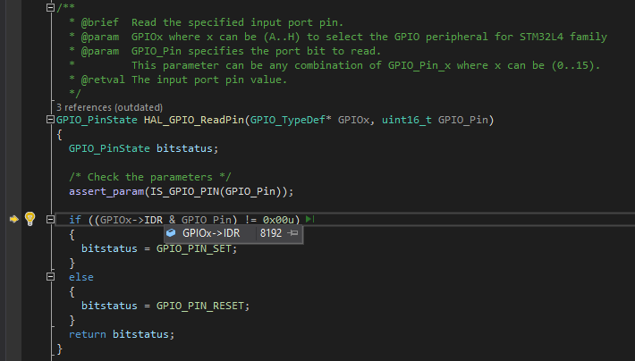

# Exercise 4: Make Blinky

From [Exercise Details](https://docs.google.com/document/d/1WRuzWj_VNoX0qyKoqVu3rr-ARXuEJDw9B2tnH1ZX_uE/edit):

On your final project board, make blinky for yourself. Then add a button to turn the LED on and off. 
Bonus points for making the button cause an interrupt. Triple bonus points for debouncing the button signal.

## What are the hardware registers that cause the LED to turn on and off? (From the processor manual, don’t worry about initialization.) 

My [Initial VisualGDB project](https://github.com/gojimmypi/IoT_BBQ/tree/f9dab949fbbb88e6c5072c864743b30965233673/IoT_BBQ_STM32) 
coincidentally happened to be a [Blinky for RTOS](https://github.com/gojimmypi/IoT_BBQ/blob/f9dab949fbbb88e6c5072c864743b30965233673/IoT_BBQ_STM32/IoT_BBQ_STM32.c#L100).

Unfortunately, the [default GPIO assignments for that tempate project](https://github.com/gojimmypi/IoT_BBQ/blob/f9dab949fbbb88e6c5072c864743b30965233673/IoT_BBQ_STM32/IoT_BBQ_STM32.c#L62)
were incorrect. Instead of [GPIO_PIN_12 and GPIO_PIN_13](https://github.com/gojimmypi/IoT_BBQ/commit/67924b3a7dde185c6e0f1158f6e9990a50225455#diff-faa7d63cec73dbe50689e1c79169000372289c072488b7f9f469e22e6f4d3a20)
I found that my board has LEDs `LED1` on Port A [GPIO_PIN_5](https://github.com/gojimmypi/IoT_BBQ/blob/67924b3a7dde185c6e0f1158f6e9990a50225455/IoT_BBQ_STM32/IoT_BBQ_STM32.c#L69)
and `LED2` on Port B [GPIO_PIN_14](https://github.com/gojimmypi/IoT_BBQ/blob/67924b3a7dde185c6e0f1158f6e9990a50225455/IoT_BBQ_STM32/IoT_BBQ_STM32.c#L79) as shown in Table 2 in Chapter 7 of the 
[User Manual](https://www.st.com/resource/en/user_manual/um2153-discovery-kit-for-iot-node-multichannel-communication-with-stm32l4-stmicroelectronics.pdf):


## What are the button registers that you read? 

There are 2 buttons on my board: `B1`, _RESET_ and `B2` _Wake-Up_. Although not specified in the table above, there's indication on the schematic (page 43) of the 
[User Manual](https://www.st.com/resource/en/user_manual/um2153-discovery-kit-for-iot-node-multichannel-communication-with-stm32l4-stmicroelectronics.pdf) that the Wake-up button is
found on Pin 7, Port C GPIO13:


See also the `B2` detail on page 51, noting in particular there's already a 100K pullup resistor, `R23`:


Additionally, note there's already a built-in RC debounce at `C36`, `C37` and `R24`.


## Can you read that memory directly and see the button change in a debugger or by printing out the associated memory?

There's a HAL function called [HAL_GPIO_ReadPin](https://github.com/gojimmypi/IoT_BBQ/blob/18babdb9736c54fd5a585352d3bb2d1d7c56bac0/IoT_BBQ_STM32/_main.c#L152) 
that by default when the switch is _not_ pressed, returns a value of `GPIO_PIN_SET` ("on", which is expected, given the pullup resistor, and normally-open switch)


When single step debugging, and the button is then pressed, the [next call to HAL_GPIO_ReadPin](https://github.com/gojimmypi/IoT_BBQ/blob/18babdb9736c54fd5a585352d3bb2d1d7c56bac0/IoT_BBQ_STM32/_main.c#L156) returns a value of `GPIO_PIN_RESET`  ("off", which when pressed, pulls the line to ground)


The code for this HAL function is found in `stm32l4xx_hal_gpio.c` and looks like this:



One _could_ read directly from `(GPIOx->IDR & GPIO_Pin)`, although for code portability it is best to use the HAL.


## Turn in your code with a comment or additional file answering the questions.

See [project files](https://github.com/gojimmypi/IoT_BBQ/tree/a850251c842d0874489bd994279bdcde903882a5), in particular, [main()](https://github.com/gojimmypi/IoT_BBQ/blob/a850251c842d0874489bd994279bdcde903882a5/IoT_BBQ_STM32/_main.c#L95).
There are 2 separate RTOS threads for controlling [LED1](https://github.com/gojimmypi/IoT_BBQ/blob/a850251c842d0874489bd994279bdcde903882a5/IoT_BBQ_STM32/_main.c#L210)
and [LED2](https://github.com/gojimmypi/IoT_BBQ/blob/a850251c842d0874489bd994279bdcde903882a5/IoT_BBQ_STM32/_main.c#L213).


The final version of my blinky uses the push button to control the [mode](https://github.com/gojimmypi/IoT_BBQ/blob/85dd40f15f56ba21bfe317fba5d7d07867083e23/IoT_BBQ_STM32/_main.c#L46) of the `LD2` LED: 

 - `IsBlinking` alternates between [LED_ON()](https://github.com/gojimmypi/IoT_BBQ/blob/85dd40f15f56ba21bfe317fba5d7d07867083e23/IoT_BBQ_STM32/_main.c#L243) and [LED_OFF()](https://github.com/gojimmypi/IoT_BBQ/blob/85dd40f15f56ba21bfe317fba5d7d07867083e23/IoT_BBQ_STM32/_main.c#L269)
 - `AlwaysOn`  even if the `LED_OFF()` is called, this mode ensure the `LD2` LED is [always on](https://github.com/gojimmypi/IoT_BBQ/blob/85dd40f15f56ba21bfe317fba5d7d07867083e23/IoT_BBQ_STM32/_main.c#L273).
 - `AlwaysOff` even if the `LED_ON()` is called, this mode ensure the `LD2` LED is [always off](https://github.com/gojimmypi/IoT_BBQ/blob/85dd40f15f56ba21bfe317fba5d7d07867083e23/IoT_BBQ_STM32/_main.c#L251).

 As there are 2 LEDs the target blinky `LD2`, and the other, `LD1` is used to indicate blinky mode:
 - `IsBlinking` - `LD1` blinks once, then pauses. repeat; `LD2` is blinking on 555ms duration on, and 555ms off.
 - `AlwaysOn` - `LD1` blinks twice, then pauses. repeat; `LD2` stays on.
 - `AlwaysOff` - `LD1` blinks three times, then pauses. repeat; `LD2` stays off.

Here's a YouTube video of the blinky in action: 
[](https://www.youtube.com/watch?v=RCKf-NEh-AY)

## Discussion Points:

### Why does the author use “marketing comes to you” through this chapter? How does it relate to previous chapters?
Pretty much every programmer knows that the requirements continually evolve and change for just about every project. Embedded development is no different. 
Often times, it is the marketing folks that have "insight" and new ideas of what consumers want.

### Would you rather use a HAL or not? Why? What are the advantages either way?
I would prefer to use a HAL unless there were memory contraints.
The HAL will typically be larger code size, but more easily portable between different target processors.

### Peer review button blinkies
(to be done in class)

### Given an input interrupt, output(s), and timers, what could you build? How many things are just a combination of these?
Limited by the imagingation! An output could trigger anything from a simple LED to a massive solid state relay controlling high-current / high voltage systems.

## Initialization:

The LED initialization looks like this:

```
    __GPIOA_CLK_ENABLE();
    __GPIOB_CLK_ENABLE();

	GPIO_InitTypeDef GPIO_InitStructureA;

    GPIO_InitStructureA.Pin = GPIO_PIN_5;

    GPIO_InitStructureA.Mode = GPIO_MODE_OUTPUT_PP;
    GPIO_InitStructureA.Speed = GPIO_SPEED_FREQ_HIGH;
    GPIO_InitStructureA.Pull = GPIO_NOPULL;
    HAL_GPIO_Init(GPIOA, &GPIO_InitStructureA);

    
    GPIO_InitTypeDef GPIO_InitStructureB;

    GPIO_InitStructureB.Pin = GPIO_PIN_14;

    GPIO_InitStructureB.Mode = GPIO_MODE_OUTPUT_PP;
    GPIO_InitStructureB.Speed = GPIO_SPEED_FREQ_HIGH;
    GPIO_InitStructureB.Pull = GPIO_NOPULL;
    HAL_GPIO_Init(GPIOB, &GPIO_InitStructureB);

```

The Button initialization looks like this:

```
    // Initialize Port C
    GPIO_InitTypeDef GPIO_InitStructureC;

    GPIO_InitStructureC.Pin = GPIO_PIN_13;

    GPIO_InitStructureC.Mode = GPIO_MODE_INPUT;
    GPIO_InitStructureC.Speed = GPIO_SPEED_FREQ_HIGH;
    GPIO_InitStructureC.Pull = GPIO_NOPULL;
    HAL_GPIO_Init(GPIOC, &GPIO_InitStructureC);
    
    // create a SwitchState variable to hold the result of out button press 
    GPIO_PinState SwitchState;
```

<< [Exercise 3b](./Exercise_3b.md) -- [Assignments](./README.md) -- [Exercise 5](./Exercise_5.md) >>