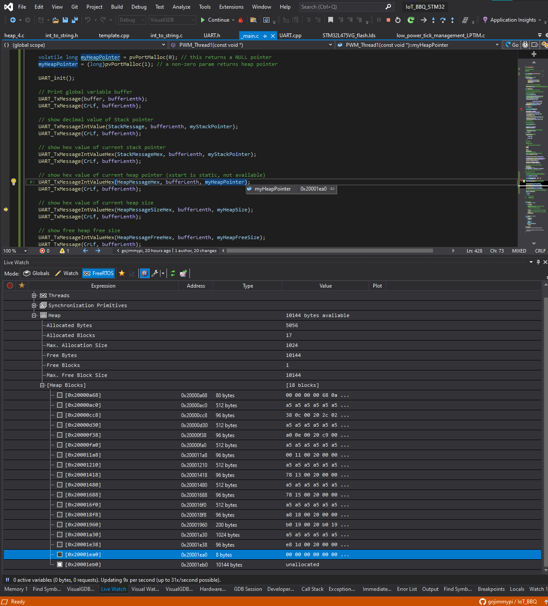

# Exercise 8 Heap and Stack Pointers

Compile your project code so it prints out the heap pointer and the stack pointer. Print out a global variable address. 
If you can find it, modify your linker file to swap your uninitialized variables and initialized variables. 
Verify it is as expected in the memory map. See how that changes your code output. 

Turn in your notes on what you found to Discord #assignment-submission by 9am on Jan 29th. 

Note: there will be more detailed hints on how to do this as the week goes on. If you get stuck, look in the Discord #homework-help for a Hints thread.

## Result

Here's the 
[stack](https://github.com/gojimmypi/IoT_BBQ/blob/106784c506af993e4949d96c450d91733ee2f3fe/IoT_BBQ_STM32/_main.c#L389), 
[heap](https://github.com/gojimmypi/IoT_BBQ/blob/106784c506af993e4949d96c450d91733ee2f3fe/IoT_BBQ_STM32/_main.c#L411), 
and [global variable](https://github.com/gojimmypi/IoT_BBQ/blob/106784c506af993e4949d96c450d91733ee2f3fe/IoT_BBQ_STM32/_main.c#L30) addresses printed out the UART:


Given two global variables, one [initialized](https://github.com/gojimmypi/IoT_BBQ/blob/d6a782fa75ff63185452af4ad6737e4db91b9b61/IoT_BBQ_STM32/_main.c#L32) with a value of `42`
and the other [not initialized](https://github.com/gojimmypi/IoT_BBQ/blob/d6a782fa75ff63185452af4ad6737e4db91b9b61/IoT_BBQ_STM32/_main.c#L31):

```
static int myNotInitializedVariable;
static int myInitializedVariable = 42;
```
The global addresses for each of the above variable are shown here, the messages sent out of the UART and received by `putty`:


Those addresses are confirmed by VisualGDB Global Live Watch:


Upon [swapping uninitialized variables and initialized variables](https://github.com/gojimmypi/IoT_BBQ/commit/176007658a9f9f787b2cf8d68e74c16a196d13ef#diff-947cad9d8806e1f3e06bc4a751f2f9b4ca05367b64068dfc15ac1904fc2d4890)
the new addresses were observed:


However the Global Live Watch result was unexpected:


Contrary to the Global Watch, the manual watch showed a value and address consistent with the `putty` output values: 

`0x20004440 <myInitializedVariable> {0x0000002a}`:


So which is correct? An [additional programmatic assignment](https://github.com/gojimmypi/IoT_BBQ/blob/688a7cbbd65cedb348adb1562dad32c2918f921b/IoT_BBQ_STM32/_main.c#L457) confirmed the value is indeed `42`: 

```
volatile int checkValue = myInitializedVariable;
```

## Stack Pointers

Variables in functions are stored on the stack. Thank you [stackoverflow for the reminder on how to determine the address of a variable on the stack](https://stackoverflow.com/questions/20059673/print-out-value-of-stack-pointer),
which of course is the most recent stack pointer:

```
        void* p = NULL;
        volatile long myStackPointer = (long)((void*)&p);
```

The address of the _next_ variable on the stack would be the current stack pointer plus the size of the latest object (or pointer) that was pushed onto the stack.

VisualGDB has the capability of showing live FreeRTOS environment details. Here the newly-allocated address of `p` has a value of `0x200013F0`:


The live watch also helps us with the address of the stack pointer in this FreeRTOS thread: `0x20001418`. A means of determining this value directly from the inside of `[Raw TCB]` (shown above) has not yet been determined.

We can also observe that FreeRTOS apparently has (72-8 = 64) bytes of overhead on the stack, probably for the pre-emptive scheduler. 
Also shown is the stack starting in this thread at `pxTopOfStack = 0x200013c8`. 

The next value of the stack pointer was `0x200013c8` after [allocation](https://github.com/gojimmypi/IoT_BBQ/blob/106784c506af993e4949d96c450d91733ee2f3fe/IoT_BBQ_STM32/_main.c#L392)
of `int *q`. (`0x200013F0 - 0x200013e8 = 8`) byte change: the size of the `volatile long myStackPointer2`.

```
    void* p = NULL;
    volatile long myStackPointer = (long)((void*)&p);
    
    void* q = NULL;
    volatile long myStackPointer2 = (long)((void*)&q);

    int* r = (int*)0xAD;
    volatile long myStackPointer3 = (long)((void*)&r);
```

Unlike the stack, subsequent heap addresses may not be easily predictable, particularly when the heap becomes fragmented.

## Heap Size and Pointers

The heap size and pointers are a bit more interesting, particularly since the [Final Project](./Final_Project.md) is using and RTOS. The [FreeRTOS Memory Management](https://www.freertos.org/a00111.html) documentation was helpful here. 
In particular the [heap_4.c xPortGetFreeHeapSize()](https://github.com/STMicroelectronics/STM32CubeL4/blob/f93a2f74f8e9912405dbf1a297b6df0c423eddf2/Middlewares/Third_Party/FreeRTOS/Source/portable/MemMang/heap_4.c#L315) found in the 
[Github.com/STMicroelectronics/STM32CubeL4](https://github.com/STMicroelectronics/STM32CubeL4/) library. This code was also found to have been installed via STH32Cube here:

```
C:\Users\gojimmypi\STM32Cube\Repository\STM32Cube_FW_L4_V1.17.1\Middlewares\Third_Party\FreeRTOS\Source\portable\MemMang
```

Similar to the [Stack Pointers](https://github.com/gojimmypi/IoT_BBQ/blob/main/Assignments/Exercise_8.md#stack-pointers), the heap pointer is determined by allocating heap space via the RTOS `pvPortMalloc`, see 
[myHeapPointer](https://github.com/gojimmypi/IoT_BBQ/blob/106784c506af993e4949d96c450d91733ee2f3fe/IoT_BBQ_STM32/_main.c#L411):

```
myHeapPointer = (long)pvPortMalloc(1); // a non-zero param returns heap pointer
```

The VisualGDB FreeRTOS Live Watch verified the most recent allocation at address `0x20001ea0` as shown in the putty UART output [result](https://github.com/gojimmypi/IoT_BBQ/blob/main/Assignments/Exercise_8.md#result), above. 



## Linker File

The [linker file](./Exercise_8_STM32L475VG_flash.lds), `STM32L475VG_flash.lds` needed to be manually copied to the project directory, as by default it is located in:

```
C:\Users\gojimmypi\AppData\Local\VisualGDB\EmbeddedBSPs\arm-eabi\com.sysprogs.arm.stm32\STM32L4xxxx\LinkerScripts
```


Pressing the `Copy to project directory` did exactly that, changing the full path to just a file name located in the root of the project directory:


Delete the filename and leave it blank to have the default changed to the original path. The local project file is _not_ automatically deleted.

The [first line of the linker script](https://github.com/gojimmypi/IoT_BBQ/blob/main/Assignments/Exercise_8_STM32L475VG_flash.lds#L1) for VisualGDB indicates that it is generated by [this C# app](http://visualgdb.com/tools/LinkerScriptGenerator).
No local `LinkerScriptGenerator*.*`files were found.

The linker file is [configured to save the heap in SRAM](https://github.com/gojimmypi/IoT_BBQ/blob/90c0f3c8a2cc72bcf0247367f3cc2642e352d556/Assignments/Exercise_8_STM32L475VG_flash.lds#L129), 
as is the [stack](https://github.com/gojimmypi/IoT_BBQ/blob/90c0f3c8a2cc72bcf0247367f3cc2642e352d556/Assignments/Exercise_8_STM32L475VG_flash.lds#L131).

The [.bss](https://en.wikipedia.org/wiki/.bss) section _contains statically allocated variables that are declared but have not been assigned a value yet_. The 
[default](https://github.com/gojimmypi/IoT_BBQ/blob/0237a7ca264606b2d083d45d6de9c52a415f4bcd/Assignments/Exercise_8_STM32L475VG_flash.lds#L118) saves this data in SRAM.


TODO: where is uninitialized data defined in the linker file?


## Map file

The default setting was to _not_ generare a linker map file.


Only a one instance of `.isr_vector` was found in the solution:


Specifically, in this directory:

```
C:\Users\gojimmypi\AppData\Local\VisualGDB\EmbeddedBSPs\arm-eabi\com.sysprogs.arm.stm32\STM32L4xxxx\StartupFiles
```

But when seaching all files there were three instances


Specifically, `.isr_vector` was found in this directory at line [5,519](https://github.com/gojimmypi/IoT_BBQ/blob/4b319f3829f95a9f9d6610694b39b27357717030/Assignments/Exercise_8_IoT_BBQ_STM32.map#L5519):

```
C:\workspace\IoT_BBQ\IoT_BBQ_STM32\VisualGDB\Debug
```

The [IoT_BBQ_STM32.map](./Exercise_8_IoT_BBQ_STM32.map) file is over 7,000 lines long. Additionally, when building the project, any manual changes are over-written by a fresh generation of the file.


## References:

* VisualGDB [Customizing Memory Layout of Embedded Programs with GNU Linker Scripts](https://visualgdb.com/tutorials/arm/linkerscripts/)
* FreeRTOS [Memory allocation implementations included in the RTOS source code download](https://www.freertos.org/a00111.html)
* Stackoverflow [Print out value of stack pointer](https://stackoverflow.com/questions/20059673/print-out-value-of-stack-pointer)
* ST Community [How to check stack and heap usage during run time.](https://community.st.com/s/question/0D50X00009XkWiq/how-to-check-stack-and-heap-usage-during-run-time)
* ST [Description of STM32L4/L4+ HAL and low-layer drivers - UM1884](https://www.st.com/resource/en/user_manual/dm00173145-description-of-stm32l4l4-hal-and-lowlayer-drivers-stmicroelectronics.pdf)

<< [Exercise 7](./Exercise_7.md) -- [Assignments](./README.md) --  [TBD]() >>