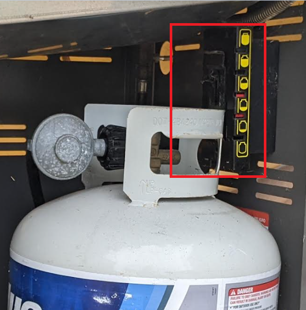

# Final Project

This document addresses the [Final Project Instructions](./Final_Project_Instructions.md) for the [Making Embedded Systems](https://lms.classpert.com/classpert-x/courses/making-embedded-systems-wUXIUA) class.

The objective is to create Propane Tank Weight Sensor System with something considerably more accurate and precise to replace the stock mechanical spring gauge:

   
 
## Minimum Project Requirements
 
The project must:

### (a) Use a Cortex-M processor: 

This project is using an STMicro STML4, specifically the [STM32L475VG](https://www.st.com/resource/en/datasheet/stm32l475vg.pdf), 
part of the [STM32 Ultra Low Power](https://www.st.com/en/microcontrollers-microprocessors/stm32-ultra-low-power-mcus.html) Arm® Cortex®-M4 32-bit MCU+FPU series.

### (b) Have a button that causes an interrupt

This project leverages the code from [Exercise 4](./Exercise_4.md) that implements an operational mode-switch via interrupt-driven button press code.

### (c) Use at least three peripherals such as ADC, DAC, PWM LED, Smart LED, LCD, sensor, BLE

The peripherals used in the project:

* Load cell (weight sensor) such as the [SparkFun HX711](https://www.sparkfun.com/products/13879). See [Project HX711 code](../IoT_BBQ_STM32/HX711/).

* Display: SSD1306 OLED Dual Color (Yellow / Blue) such as [this I2C Serial 12864 on Amazon](https://www.amazon.com/dp/B08KY21SR2/) that includes mbedded Driver IC. See [Project SSD1306 code](../IoT_BBQ_STM32/SSD1306/)

* Temperature Sensor (The onboard device TODO specify)

* Onboard LED: See [Project LED code](../IoT_BBQ_STM32/LED/)

### (d) Have serial port output

See  [Project UART code](../IoT_BBQ_STM32/UART/)

### (e) Implement an algorithmic piece that makes the system interesting

### (f) Implement a state machine

## List of the tasks to complete for the project

1) Get display working
2) Get weight sensors working
3) Design enclosure

## Challenges

### Mechanical support for weight sensor

### Enclosure

It should probably be weather-proof. 

The OLED display is likely not tolerqant to hard freeze.

