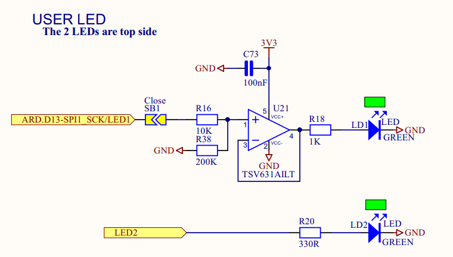

# Final Project

This document addresses the [Final Project Instructions](./Final_Project_Instructions.md) for the [Making Embedded Systems](https://lms.classpert.com/classpert-x/courses/making-embedded-systems-wUXIUA) class.

The objective is to create Propane Tank Weight Sensor System with something considerably more accurate and precise to replace the stock mechanical spring gauge:

   
 
## Minimum Project Requirements
 
The project must:

### (a) Use a Cortex-M processor: 

This project is using an STMicro STML4, specifically the [STM32L475VG](https://www.st.com/resource/en/datasheet/stm32l475vg.pdf), 
part of the [STM32 Ultra Low Power](https://www.st.com/en/microcontrollers-microprocessors/stm32-ultra-low-power-mcus.html) Arm® Cortex®-M4 32-bit MCU+FPU series
found on the  [B-L475E-IOT01A Discovery Board](https://www.st.com/resource/en/user_manual/um2153-discovery-kit-for-iot-node-multichannel-communication-with-stm32l4-stmicroelectronics.pdf).

The prototype uses the [Discovery kit for IoT node](https://www.st.com/resource/en/user_manual/um2153-discovery-kit-for-iot-node-multichannel-communication-with-stm32l4-stmicroelectronics.pdf).
 


### (b) Have a button that causes an interrupt

This project leverages the code from [Exercise 4](./Exercise_4.md) that implements an operational mode/state switch via interrupt-driven button press code.

### (c) Use at least three peripherals such as ADC, DAC, PWM LED, Smart LED, LCD, sensor, BLE

The peripherals used in the project:

#### External:

* Load cell (weight sensor) such as the [SparkFun HX711](https://www.sparkfun.com/products/13879). See [HX711 code](../IoT_BBQ_STM32/HX711/).

* Display: SSD1306 OLED Dual Color (Yellow / Blue) such as [this I2C Serial 12864 on Amazon](https://www.amazon.com/dp/B08KY21SR2/) that includes mbedded Driver IC. See [SSD1306 code](../IoT_BBQ_STM32/SSD1306/)

* Temperature Sensor (The onboard device TODO specify)

#### Internal

* PWM Timers and watchdogs

See Page 44 of the [STM32L475xx Datasheet (DS10969)](https://www.st.com/resource/en/datasheet/stm32l475vg.pdf):


* Onboard LED: See [LED code](../IoT_BBQ_STM32/LED/)



### (d) Have serial port output

See  [UART code](../IoT_BBQ_STM32/UART/)

### (e) Implement an algorithmic piece that makes the system interesting

> _Every sensor is a temperature sensor. Some are better than others._ --[Unknown / Elecia White](https://electronics.stackexchange.com/questions/386691/who-said-all-sensors-are-temperature-sensors-but-some-are-better-than-others)

Consider measuring weight over time and temperature. 

TODO: _interesting_


### (f) Implement a state machine

There's currently a prototype [LED STate Machine](https://github.com/gojimmypi/IoT_BBQ/blob/ce44c00152af0a16b26d9a246a799ed7db8553ae/IoT_BBQ_STM32/LED/LED.cpp#L23) 
with [IsBlinking, AlwaysOn, AlwaysOff](https://github.com/gojimmypi/IoT_BBQ/blob/ce44c00152af0a16b26d9a246a799ed7db8553ae/IoT_BBQ_STM32/LED/LED.h#L14) states.

### Not required to use a HAL (but it is encouraged)

This project uses the STM32L4XX HAL, for example [here](https://github.com/gojimmypi/IoT_BBQ/blob/ce44c00152af0a16b26d9a246a799ed7db8553ae/IoT_BBQ_STM32/_main.c#L2), 
and is a mult-threaded application using embedded RTOS (specfically [CMSIS_RTOS](https://arm-software.github.io/CMSIS_5/RTOS2/html/rtos_api2.html)) for example included [here](https://github.com/gojimmypi/IoT_BBQ/blob/ce44c00152af0a16b26d9a246a799ed7db8553ae/IoT_BBQ_STM32/_main.c#L3).

Code that uses the STM32 HAL will need the `#include <stm32l4xx_hal.h>`. Future versions of this codebase should include a hardware conditional include such as [this](https://github.com/gojimmypi/IoT_BBQ/blob/314d03bb8053d09c3730533c384fd499d35e3231/IoT_BBQ_STM32/SSD1306/ssd1306.h#L18) example:

```
#if defined(STM32F0)
#include "stm32f0xx_hal.h"
#elif defined(STM32F1)
#include "stm32f1xx_hal.h"
#elif defined(STM32F4)
#include "stm32f4xx_hal.h"
#include "stm32f4xx_hal_gpio.h"
#elif defined(STM32L0)
#include "stm32l0xx_hal.h"
#elif defined(STM32L1)
#include "stm32l1xx_hal.h"
#elif defined(STM32L4)
#include "stm32l4xx_hal.h"
#elif defined(STM32F3)
#include "stm32f3xx_hal.h"
#elif defined(STM32H7)
#include "stm32h7xx_hal.h"
#elif defined(STM32F7)
#include "stm32f7xx_hal.h"
#elif defined(STM32G0)
#include "stm32g0xx_hal.h"
#elif defined(STM32G4)
#include "stm32g4xx_hal.h"
#else
#error "Hardware platform not supported."
#endif
```


## List of the tasks to complete for the project

- [X] Confirm operational display
- [X] Confirm operational weight sensor
- [ ] Show weight value on display
- [ ] Update docs on new I2C port being used for SSD1306
- [X] Confirm serial port operation
- [ ] Implement Serial Rx/Tx
- [ ] Implement serial debug messages
- [ ] Sleep serial port when inactive
- [ ] Implement Sleep / Wake-up
- [ ] Determine field power source
- [ ] Design enclosure
- [ ] Print enclosure
- [ ] Mount hardware in enclosure


## Challenges

There are plenty of potential challenges. This project was originally started (and abandoned) [6 years ago](https://github.com/gojimmypi/IoT_BBQ/tree/c15d7c90c0f49ad006a91550d2dd1ab7d34544e8), in part due to 
mechanical issues. It is hoped that modern 3D Printing flexibility will be able to help with the mechanical mounting aspects.

Technical implementation difficulties of a new hardware platform are always a concern (the original project was based on the ESP8266 and the LUA language).

Details on some of the challenges:

### Minimal Example Code

There is currently relatively little [STM32CubeL4 example code for the B-L475E-IOT01A discovery board](https://github.com/STMicroelectronics/STM32CubeL4/tree/master/Projects/B-L475E-IOT01A/Examples) chosen for this project. 
Porting code between architectures is beyond the scope of the class.

Furthermore, the HX711 weight sensor interface and SSD1306 display are not built-in on the development board. 

### External sensors and peripherals

Certainly one of the benefits of having an evaluation board is having the connections "built-in" and sample code readily available. Unfortunately the Discovery Board used did not have a display and the I2C HX711 load cell was of course external, 
adding the additional challenge of finding and wiring up the I2C connections.

The better part of a day was spent trying to get the SSD1306 Display to work on `I2C1` that the [documentation](https://www.st.com/resource/en/user_manual/um2153-discovery-kit-for-iot-node-multichannel-communication-with-stm32l4-stmicroelectronics.pdf) claims is on `PB8` and `PB9`,
but it was later learned the STM32CubeIDE shows GPIO pins `PB6` and `PB7` instead:


This closeup from the STM32CubeIDE clearly indicates `I2C1` GPIO pins are on `PB6` and `PB7`.


The [SSD31306 configuration](../IoT_BBQ_STM32/SSD1306/ssd1306_conf.h) is currently using `I2C3` instead. (See also the [SSD1306 default template](../IoT_BBQ_STM32/SSD1306/ssd1306_conf_template.h))

Lesson learned: always do a simple IO level and control check on GPIO lines before starting somwthing more complex such as I2C communication.

### Known library Problems

There's an [open STMicroelectronics/stm32l0xx_hal_driver issue: An I2C NACK during memory address transfer goes undetected](https://github.com/STMicroelectronics/stm32l0xx_hal_driver/issues/3) to be aware of that may impact I2C. 
This was stumbled upon when encountering a `I2C_WaitOnFlagUntilTimeout` problem, but that was related to the GPIO pin conflict, described above.

### Mechanical support for weight sensor

I [reached out on Twitter](https://twitter.com/gojimmypi/status/1481711080497823744?s=20) for suggestions on how to mount the load cell. 
One of the responses is regarding [load cell damage if the propane tank is dropped into place](https://twitter.com/RueNahcMohr/status/1481724026221305861?s=20).

Another concern is [load cell creep](https://twitter.com/GMahovlic/status/1481724848040775685?s=20) when the tank is left in place for a long period. 

There's no mention of "load creep" in the [Avia Semicondictor HX711 Datasheet](https://cdn.sparkfun.com/assets/b/f/5/a/e/hx711F_EN.pdf), but that seems like a legitimate concern. There is only
one instance of the word "creep" on the [Sparkfun Load Cell Amplifier HX711 Breakout Hookup Guide](https://learn.sparkfun.com/tutorials/load-cell-amplifier-hx711-breakout-hookup-guide/all).

Yet another potential challenge pointed out on Twitter is the [temperaturer drift over time](https://twitter.com/ioPush_net/status/1481762159851974660?s=20) of the load cell.

### Physical Room

There's relatively limited room for the tank: so little, that there's a hole in the bottom of the cabinet to help with maneuvering when replacing a fresh tank:


### Enclosure

Enclosures are always challenging. Fortunately there's a 3D Printer available to create a custom enclosure for this project.

The enclosure should probably be weather-proof, and located reasonably far from the grill heat box which can get up to 500 degrees.

The OLED display is likely not tolerant to hard freeze. 

### Component Availability

If any sort of mass-production was desired, there's of course the chip shortage to be concerned about.


## Deliverables

The final project will be delivered as:

(a) Video of the system working as intended (link to mp4 or youtube)  ** TODO **

(b) Write up of the system (PDF or Google docs report). This document.

(c) Link to the code: see [GitHub IoT BBQ STM32 Project](https://github.com/gojimmypi/IoT_BBQ/tree/main/IoT_BBQ_STM32)


## Optional Bonus

### Power analysis

Tips learned from Ben in class:

- When powering an embedded device from batteries, say a couple of AA cella, there's likely a voltage drop / fluctuation depending on what
the processor is doing at any given moment, that may affect things like ADC.


### Firmware update

TODO


### System profiling

TODO

The Power LED is always on, and needs to be unsoldered to not use it:


## References

### Mechanical

- Wikipedia [Propane](https://en.wikipedia.org/wiki/Propane)
- Statasys Grabcad Community [Propane Tank](https://grabcad.com/library/propane-tank)

### Core Hardware

- [STM32 Discovery Kits](https://www.st.com/en/evaluation-tools/stm32-discovery-kits.html#products)
- [STM32L4 series of ultra-low-power MCUs](https://www.st.com/en/microcontrollers-microprocessors/stm32l4-series.html)
- [ARM MBED DISCO-L475VG-IOT01A (B-L475E-IOT01A](https://os.mbed.com/platforms/ST-Discovery-L475E-IOT01A/) (this is where the link on the OTG file points)
- [Mouser 5 page B-L475E-IOT01A Data Brief ](https://www.mouser.com/datasheet/2/389/b-l475e-iot01a-1848022.pdf)
- [Mouser Discovery Kit for IoT Node](https://www.mouser.com/pdfdocs/RS7706_IC_STM32L475E-IOT01A1_0517d.pdf) (this is the front and back of the insert card in for the shipped product)
- [Mouser STMicroelectronics B-L475E-IOT01A Discovery Kit for IoT Node](https://www.mouser.com/new/stmicroelectronics/stm-b-l475e-iot01a-kit/)

### Drivers

- [ST-LINK, ST-LINK/V2, ST-LINK/V2-1, STLINK-V3 USB driver signed for Windows7, Windows8, Windows10](https://www.st.com/content/my_st_com/en/products/development-tools/software-development-tools/stm32-software-development-tools/stm32-utilities/stsw-link009.license=1637530388106.product=STSW-LINK009.version=2.0.2.html)


### Peripheral Hardware

- [SSD1306 I2C Serial](https://www.amazon.com/dp/B08KY21SR2/)
- [Sparkfun Load Cell Amplifier HX711 Breakout Hookup Guide](https://learn.sparkfun.com/tutorials/load-cell-amplifier-hx711-breakout-hookup-guide/all)
- [bogde/HX711](https://github.com/bogde/HX711)
- [nimaltd/HX711](https://github.com/nimaltd/HX711/blob/master/hx711.c)

### Development Environment

- Microsoft [Visual Studio 2019](https://docs.microsoft.com/en-us/visualstudio/releases/2019/release-notes)
- Sysprogs [VisualGDB Extension](https://visualgdb.com/)
- [CMSIS-RTOS2](https://arm-software.github.io/CMSIS_5/RTOS2/html/index.html)
- ST [STM32L4 Discovery kit IoT node software](https://www.st.com/en/evaluation-tools/b-l475e-iot01a.html#tools-software)
- ST [STM32CubeMX STM32Cube initialization code generator](https://www.st.com/en/development-tools/stm32cubemx.html#get-software)
- ST [STM32Cube MCU Package for STM32L4 series and STM32L4 Plus series (HAL, Low-Layer APIs and CMSIS, USB, TouchSensing, File system, RTOS)](https://www.st.com/en/embedded-software/stm32cubel4.html#tools-software)
- ST [Description of STM32L4/L4+ HAL and low-layer drivers - UM1884](https://www.st.com/resource/en/user_manual/dm00173145-description-of-stm32l4l4-hal-and-lowlayer-drivers-stmicroelectronics.pdf)


### Tutorials and Sample Code

- Sysprogs VisualGDB [Developing STM32 projects with Visual Studio tutorial](https://visualgdb.com/tutorials/arm/stm32/)
- Sysprogs VisualGDB [Using the STM32 UART interface with HAL](https://visualgdb.com/tutorials/arm/stm32/uart/hal/)
- Sysprogs VisualGDB [Using the I2C Interface on the STM32 Devices](https://visualgdb.com/tutorials/arm/stm32/i2c/)
- Sysprogs VisualGDB [Creating Advanced STM32CubeMX-based Projects with VisualGDB](https://visualgdb.com/tutorials/arm/stm32/cube/advanced/)
- Sysprogs VisualGDB [Controlling STM32 Hardware Timers using HAL](https://visualgdb.com/tutorials/arm/stm32/timers/hal/)
- Sysprogs VisualGDB [Using STM32 timers in PWM mode](https://visualgdb.com/tutorials/arm/stm32/pwm/)
- NordicPlayground [mbed stm32f4xx_hal_uart](https://github.com/NordicPlayground/mbed/blob/master/libraries/mbed/targets/cmsis/TARGET_STM/TARGET_DISCO_F407VG/stm32f4xx_hal_uart.c)
- [afiskon/stm32-ssd1306 example](https://github.com/afiskon/stm32-ssd1306/blob/master/examples/oled-tester/firmware/i2c/Src/main.c); The [code](https://github.com/afiskon/stm32-ssd1306/tree/master/ssd1306) is [included in this project](../IoT_BBQ_STM32/SSD1306/).
- [Sensors STM32CubeL4/Drivers/BSP/B-L475E-IOT01/](https://github.com/STMicroelectronics/STM32CubeL4/tree/master/Drivers/BSP/B-L475E-IOT01)

### Video Tutorials

- [Digi-Key Getting Started with STM32 - Timers and Timer Interrupts](https://www.digikey.com/en/maker/projects/getting-started-with-stm32-timers-and-timer-interrupts/d08e6493cefa486fb1e79c43c0b08cc6) by [Shawn Hymel](https://www.digikey.com/en/maker/profiles/72825bdd887a427eaf8d960b6505adac)
- [STMicroelectronics STM32CubeIDE basics - 05 TIM PWM HAL lab](https://www.youtube.com/watch?v=-AFCcfzK9xc)

### Programming

- [AVR035: Efficient C Coding for AVR](https://ww1.microchip.com/downloads/en/Appnotes/doc1497.pdf)

### Cloud Demo
- [AWS AWS Cloud demonstration](https://github.com/STMicroelectronics/STM32CubeL4/tree/master/Projects/B-L475E-IOT01A/Demonstrations)

### Utilities

- [VS Code Extension: Markdown PDF](https://marketplace.visualstudio.com/items?itemName=yzane.markdown-pdf)

### Other Related Projects

- [Honeybee Hive Monitoring](https://hackaday.io/project/1741-honeybee-hive-monitoring) - also uses HX711
- [logicalelegance/midifun](https://github.com/logicalelegance/midifun/tree/master/Core) - sample project naming, directories, organziation.


