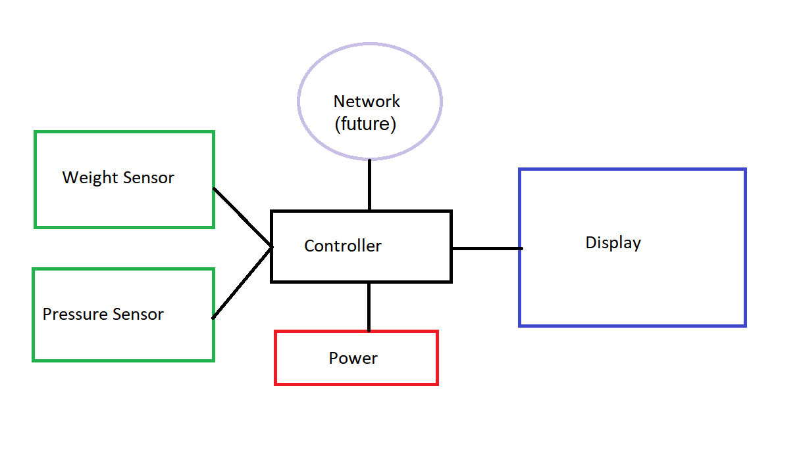

# Final Project Report

This Final Project Report is a supplement to the [Final Project Minimum Project Requirement Detail](./Final_Project.md).
An embedded microscontroller was used to create a propane tank weight measurement system. 
[Source code](https://github.com/gojimmypi/IoT_BBQ/tree/main/IoT_BBQ_STM32) is available on GitHub.

See also the [YouTube Video](https://youtu.be/YIoqKTbCUQQ):

[](https://youtu.be/YIoqKTbCUQQ)
<br/><br/>

## Application Description

This application is an embedded controller to monitor grill propane tank weight to replace the existing mechanical spring scale:


<br/><br/>

## Hardware Description

This project uses the [STM32L475VG](https://www.st.com/resource/en/datasheet/stm32l475vg.pdf), 
part of the [STM32 Ultra Low Power](https://www.st.com/en/microcontrollers-microprocessors/stm32-ultra-low-power-mcus.html) Arm Cortex-M4 32-bit MCU+FPU series
found on the  [B-L475E-IOT01A Discovery Board](https://www.st.com/resource/en/user_manual/um2153-discovery-kit-for-iot-node-multichannel-communication-with-stm32l4-stmicroelectronics.pdf).
<br/><br/>

## Software description

The application is written in C/C++ and targets the STM32 ARM Platform. 
<br/><br/>


### Describe the code in general

The code is a multi-threaded FreeRTOS embedded application. There are 5 threads named LED1, LED2, UART1, DISPLAY, and PWM.

#### LED1 Thread

The [LED1 Thread](https://github.com/gojimmypi/IoT_BBQ/blob/main/IoT_BBQ_STM32/_main_LED_Thread1.c) is a simple state machine and controls LED1 (blinky, on, or off).
This thread also sends pressure reading and scale weight text to the UART.
<br/><br/>


#### LED2 Thread

The [LED1 Thread](https://github.com/gojimmypi/IoT_BBQ/blob/main/IoT_BBQ_STM32/_main_LED_Thread2.c) monitors the state machine and blinks LED2 depending on the current state:

* `IsBlinking` - one blink
* `AlwaysOn` - two blinks
* `AlwaysOff` - three blinks
<br/><br/>


#### UART1 Thread

Just to test RTOS concurrency (and hard fault avoidance!) the [UART1 Thread]() sends a "Hello UART1" message
to the UART about every 1.35 seconds. An odd number was chosen to ensure pseudo-random conflicts in timing
with other messages.


This particular screen snip (above) is interesting. Note the seemingly stray "105" value. Apparently this is where the thread tried to grab a mutex to use the UART, but one was not available
on a timely basis, so it skipped the entire "1 weight" part of the message. Recall this occurs in [two steps](https://github.com/gojimmypi/IoT_BBQ/blob/29255d7aa78ec70aa6fd3b76e06db336202eda09/IoT_BBQ_STM32/_main_LED_Thread1.c#L57):

```
        UART_TxMessageIntValue(WeightMessage, sizeof(WeightMessage), CurrentTankWeight);
        // (RTOS Thread swtich occured around here)
        UART_TxMessage(CrLf, sizeof(CrLf));
```
<br/><br/>


#### DISPLAY Thread

The [Display Thread](https://github.com/gojimmypi/IoT_BBQ/blob/main/IoT_BBQ_STM32/DISPLAY/DISPLAY.cpp) is where the scale is monitored and the value displayed on the screen.
There's also a small state machine monitoring for a button long press to then tare the scale and save the offset value to flash.
<br/><br/>


#### PWM Thread

The [PWM thread](https://github.com/gojimmypi/IoT_BBQ/blob/main/IoT_BBQ_STM32/_main_pwm_thread.c) is included only for "interesting" experiements and is not required for basic functionality.

After some initial code experiments, the thread runs in a loop sending barometric pressure reading to the UART every 2 seconds.

Code Explorer View of [main()](https://github.com/gojimmypi/IoT_BBQ/blob/main/IoT_BBQ_STM32/_main.c)


<br/><br/>


### Describe the parts you wrote in some detail (maybe 3-5 sentences per module)

The main code repository can be found at [github.com/gojimmypi/IoT_BBQ/tree/main/IoT_BBQ_STM32](https://github.com/gojimmypi/IoT_BBQ/tree/main/IoT_BBQ_STM32). MIT License.

* [Display Code](https://github.com/gojimmypi/IoT_BBQ/tree/main/IoT_BBQ_STM32/DISPLAY) was written specifically for this project. MIT License.

* [Flash Config](https://github.com/gojimmypi/IoT_BBQ/blob/main/IoT_BBQ_STM32/Flash/flash_config.h) was created from scratch for this project. MIT license.

* [LED Blinky and State Machine](https://github.com/gojimmypi/IoT_BBQ/tree/main/IoT_BBQ_STM32/LED) created by gojimmypi for this project. MIT license.

* [UART](https://github.com/gojimmypi/IoT_BBQ/tree/main/IoT_BBQ_STM32/UART) created for this project, MIT license. Uses [stm32l4xx_hal.h](https://github.com/STMicroelectronics/STM32CubeL4/blob/master/Drivers/STM32L4xx_HAL_Driver/Inc/stm32l4xx_hal.h) 
assumed to still be [BSD 3-Clause license](https://github.com/STMicroelectronics/STM32CubeL4/blob/d023c0d560ace11509f9b761c8913a9e48fcf194/Drivers/STM32L4xx_HAL_Driver/Src/stm32l4xx_hal.c#L27)
<br/><br/>


### Describe code you re-used from other sources, including the licenses for those

This project was created using the [Sysprogs VisualGDB Extension](https://visualgdb.com/?features=embedded) for [Visual Studio 2019](https://docs.microsoft.com/en-us/visualstudio/releases/2019/release-notes).
A tiny amount of initialization code was generated using the [STM32CubeIDE](https://www.st.com/en/development-tools/stm32cubeide.html). 

* [HX711 Arduino Library](https://github.com/bogde/HX711) was ported to this STM32 HAL environment with FreeRTOS support. MIT License.

* [STM hsensor HAL](https://github.com/STMicroelectronics/STM32CubeL4/blob/master/Drivers/BSP/B-L475E-IOT01/stm32l475e_iot01_hsensor.c) BSD 3-Clause license. 

* [STM Pressure Sensor HAL](https://github.com/STMicroelectronics/STM32CubeL4/blob/master/Drivers/BSP/B-L475E-IOT01/stm32l475e_iot01_psensor.h) BSD 3-Clause license

* [ssd1306 display driver](https://github.com/afiskon/stm32-ssd1306) was created by Aleksander Alekseev and [modified](https://github.com/gojimmypi/IoT_BBQ/commits/main/IoT_BBQ_STM32/SSD1306) for this project.  MIT License

* [Flash HAL](https://github.com/STMicroelectronics/STM32CubeL4/blob/master/Drivers/STM32L4xx_HAL_Driver/Src/stm32l4xx_hal_flash.c). Assumed to still be Licensed by ST under BSD 3-Clause license, 
but the [license File is now blank](https://github.com/STMicroelectronics/STM32CubeL4/issues/63).  


Additional thanks to Elecia White (the Making Embedded Systems Instructor) for the code review, in particular to help find the cause of those nasty Hard Faults.
Also thanks to the class mentors Erin, Daniel, Thomas, and Jeff... as well as all my classmates on the discord channel. A lot of smart and creative people 
with all sorts of interesting ideas!
<br/><br/>

## Diagram(s) of the architecture

Show below is the basic diagram of the architecture. The network feature has not yet been implemented:


<br/><br/>


## Build Instructions

There are two options for building: the GUI from Visual Studio and a command-line batch file, both on Windows.
<br/><br/>


#### Build in Visual Studio


Open the Visual Studio Solution File called [IoT_BBQ_STM32.sln](https://github.com/gojimmypi/IoT_BBQ/blob/main/IoT_BBQ_STM32/IoT_BBQ_STM32.sln). 
Find the `IoT_BBQ_STM32` Project. Right-click and select "Build...":


To build and upload code, simply click the green `VisualGDB Debugger` button:


If the build was successful, the code will be sent to the board:


<br/><br/>


#### Build from Command-Line

If the STM32 toolchain is installed (for Windows) there's also an auto-generated [batch file](https://github.com/gojimmypi/IoT_BBQ/blob/main/IoT_BBQ_STM32/IoT_BBQ_STM32-Debug.bat) to build from command-line.

```

```

See also [Project Readme Build Instructions](https://github.com/gojimmypi/IoT_BBQ/tree/main/IoT_BBQ_STM32#build-from-a-batch-file)
<br/><br/>


### How to build the system (including the toolchain(s))

The only toolchain required for this project is the [VisualGDB Extension](https://visualgdb.com/). 
See the [Developing STM32 projects with Visual Studio](https://visualgdb.com/tutorials/arm/stm32/) walk-through.

These settings are included the project solution file but included here for reference:

Project Config Step 1:


Project Config Step 2:


Project Config Step 3:


See above for the [build instructions](https://github.com/gojimmypi/IoT_BBQ/blob/main/Assignments/Final_Project_Report.md#build-instructions).

<br/><br/>


### Hardware

- Mouser [ST B-L475E-IOT01A1](https://www.mouser.com/ProductDetail/stmicroelectronics/b-l475e-iot01a1/?qs=2m8Gdae5Lr3rq3rcxS2xEg%3D%3D&countrycode=US&currencycode=USD)
- Amazon [SSD1306 I2C Serial](https://www.amazon.com/dp/B08KY21SR2/)
- Sparkfun [Load Cell Amplifier HX711](https://www.sparkfun.com/products/13879?_ga=2.84341273.1032917369.1645317851-1685161029.1637878826)
- Adafruit [Strain Gauge Load Cell - 4 Wires - 20Kg](https://www.adafruit.com/product/4543)

Hardware wiring diagram:


<br/><br/>


### Software

The source code can be downloaded from [GitHub gojimmypi/IoT_BBQ](https://github.com/gojimmypi/IoT_BBQ). The only other software needed is Visual Studio and
VisualGDB (and an internet connection, as VissualGDB will download and install toolchains and libraries as needed.) 


<br/><br/>


### How you debugged and tested the system

All of the development and debugging was completed in Visual Studio using breakpoints and the single-step-debugging features available from the VisualGDB extension.

Single-step inspection:


Heap pointer check:


Memory address inspection:


Breakpoints, code explorer, and other system monitoring features were quite helpful:


<br/><br/>


## Future

Although the discovery board was convenient from a _getting started_ perspective, it is also massive and power hungry.
The next steps are to port this project to a [Blue Pill]().
<br/><br/>


## What would be needed to get this project ready for production?

Key to a production deployment would be an _enclosure_ and some way to have them mass-produced. For large-scale production, some means of
mass-programming the devices would be needed. It would not be practical to manually plug in a million boards and program them each one at a time.
<br/><br/>


## How would you extend this project to do something more? Are there other features you’d like? How would you go about adding them?

I chose this particular IoT Discovery board for the WiFi capabilities. As it turns out, the power consumption is simply way too high
for battery operation.  Our grill is located a bit far from the house; I certainly don't want to run an extension cord. 
I have some [LoRa experience](https://gojimmypi.github.io/tag/lora/) and plan to see if I can get that working with an MQTT server.

There are also plans for including a firebox temperature sensor, specifically the MAX6675 Module + K Type Thermocouple Temperature 
as described in the [original README](https://github.com/gojimmypi/IoT_BBQ/blob/main/README.md#iot_bbq) from a few years back 
when I created something for the ESP8266.
<br/><br/>

## Grading

Self assessment of the project: for each criteria, choose a score (1, 2, 3) and explain your reason for the score in 1-2 sentences.
Have you gone beyond the base requirements? How so?


| Criteria                                                       | 1 - Needs Improvement  | 2 - Meets Expectations                       | 3 - Exceeds Expectations |
| -------------                                                  | -------------          | -------------                                | ------------- | 
| Project meets minimum project goals                            |                        | 2+ [Basic State Machine](https://github.com/gojimmypi/IoT_BBQ/blob/cc7372a3d11caf1aeab8de3807fefd8d7b27aa1b/IoT_BBQ_STM32/LED/LED.cpp#L125), additional sensors [LPS22HB](https://github.com/gojimmypi/IoT_BBQ/tree/main/IoT_BBQ_STM32/LPS22HB), [HX711](https://github.com/gojimmypi/IoT_BBQ/tree/main/IoT_BBQ_STM32/HX711), well documented. No serial commands   |    |
| Completeness of deliverables                                   |                        |                                              | Readable code, [each point addressed](https://github.com/gojimmypi/IoT_BBQ/blob/main/Assignments/Final_Project.md), [video](https://youtu.be/YIoqKTbCUQQ)   |
| Clear intentions and working code                              |                        | 2+ System works as decribed                  | (docs not as professionally polished as I'd like)   |
| Reusing code                                                   |                        |                                              | [License summary](https://github.com/gojimmypi/IoT_BBQ/blob/main/Assignments/Final_Project_Report.md#describe-the-code-in-general) and [Build Info](https://github.com/gojimmypi/IoT_BBQ/blob/main/Assignments/Final_Project_Report.md#build-instructions)    |
| Originality and scope of goals                                 |                        |                                              | This is clearly an awesome Propane Tank Weight Project! ;) The scope of goals was appropriately challenging yet reasonable for the class.  |
| Self-assessment   (Mentor category only)                       |                        |   n/a                                        |          |
| Bonus: Power analysis, firmware update, or system profiling    |                        |                                              | [Power Analysis](https://github.com/gojimmypi/IoT_BBQ/blob/main/Assignments/Final_Project.md#power-analysis) also  [shared on Twitter](https://twitter.com/gojimmypi/status/1492178884883746820?s=20&t=MRzHRuswJXuYwHc56WS9yQ)       |
! Bonus: Version control was used.                               |                        |                                              | [hundreds of commits](https://github.com/gojimmypi/IoT_BBQ/commits/main)   |


* I created the video footage of the project in action on my phone and took all the pictures, but the final consolidated video was assembled and subtitled by someone else. Thank you!!!
<br/><br/>
 
See the Class Assignment [additional links](https://github.com/gojimmypi/IoT_BBQ/tree/main/Assignments#links) for other resources.

# Final Project Submission

See [Final Project Submission](./Final_Project_Submission.md)