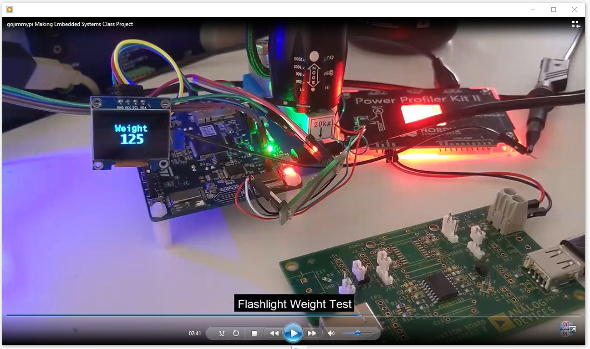

# Making Embedded Systems Project Submission.

Propane Tank Weight Measurement System

## (a) Video of the system working as intended.

[YouTube Video](https://youtu.be/YIoqKTbCUQQ):

## (b) Write up of the system (PDF or Google docs report). 

[Final Project Report](./Final_Project_Report.md) also as ([PDF](./Final_Project_Report.pdf)) (addresses the [Report Section of Final Project Instructions](https://github.com/gojimmypi/IoT_BBQ/blob/main/Assignments/Final_Project_Instructions.md#report))

[Final Project](./Final_Project.md) also as ([PDF](./Final_Project.pdf)) (addresses the [Final Project Instructions](./Final_Project_Instructions.md))

## (c) Link to the code: 

Source code can be found at [GitHub IoT BBQ STM32 Project](https://github.com/gojimmypi/IoT_BBQ/tree/main/IoT_BBQ_STM32).

