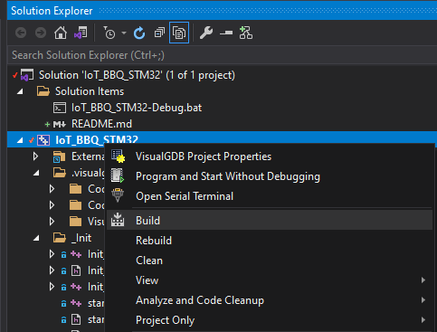

# IoT BBQ STM32

## Build from Visual Studio

The [IoT_BBQ_STM32](https://github.com/gojimmypi/IoT_BBQ/blob/main/IoT_BBQ_STM32/IoT_BBQ_STM32.sln) is a Visual Studio 2019 solution file with a SysProgs VisualGDB extension project.

Build simply by right-click and build...




## Build from a batch file:

Assumes toolchain is installed in: `c:\SysGCC\arm-eabi\bin\arm-none-eabi-gcc.exe`

```
SET WORKSPACE=C:\workspace\
c:
if not exist "%WORKSPACE%" mkdir "%WORKSPACE%"

cd "%WORKSPACE%"
if exist "%WORKSPACE%" goto error

git clone https://github.com/gojimmypi/IoT_BBQ.git
cd "%WORKSPACE%"
cd IoT_BBQ\IoT_BBQ_STM32


goto done
:error
echo Error 

:done
echo done!

```